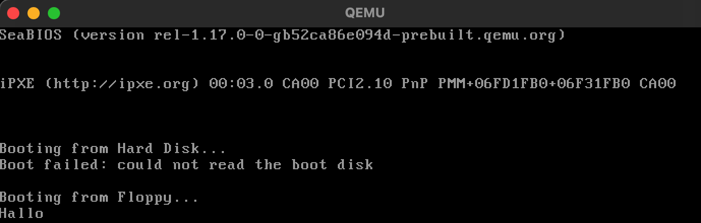

# Mein erster Bootloader

Das ist mein erstes Experiment, ein winziges Betriebssystem von Grund auf zu schreiben.

Es ist ein 512-Byte Bootloader in 16-Bit x86 Assembly. Wenn er von einem Standard-BIOS geladen wird, gibt er die Zeichenkette "Hallo" auf dem Bildschirm aus.

Das Ziel von diesem Projekt war, den Boot-Prozess, 16-Bit Assembly und die Verwendung von BIOS-Interrupts (wie `int 0x10` für die Videoausgabe) wirklich zu verstehen.

---

### Benötigte Tools

Um diesen Code zu kompilieren und auszuführen, brauchst du zwei plattformübergreifende Tools:
* **NASM:** Der Assembler, der unseren Code in Maschinensprache übersetzt.
* **QEMU:** Der Emulator, der eine virtuelle x86-Maschine startet, um unseren Code zu booten.

### Tools installieren

**Auf macOS (mit Homebrew):**
```bash
brew install nasm qemu
```

**Auf Linux:**
```bash
sudo apt install nasm qemu-system-x86
```

## Wie man es ausführt

**1. Kompilieren:** Dieser Befehl erstellt aus der .asm Datei eine flache .bin Datei, 
die unser Bootleader ist.

```bash
nasm boot.asm -f bin -o boot.bin
```

**2. Starten:** Dieser Befehl startet die QEMU-VM und sagt ihr, sie soll unsere `` `boot.bin` ``-Datei 
als "Floppy Disk" (Boot-Medium) verwenden.

```bash
qemu-system-x86_64 -fda boot.bin
```

## Das Ergebnis in QUEMU: 


